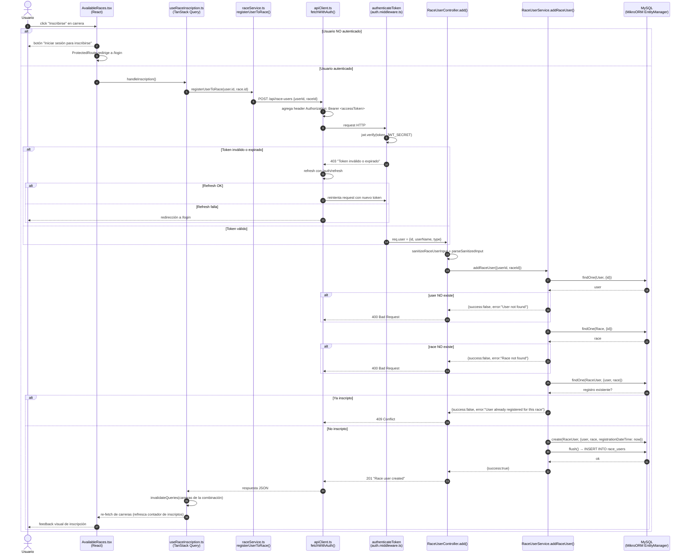

# CUU — Inscripción a una carrera (Diagrama de Secuencia de Diseño)

## Descripción del caso de uso

| Atributo | Valor |
| --- | --- |
| **Caso de uso** | Inscripción a una carrera (self-service) |
| **Actor** | Usuario registrado (tipo `common`, `premium` o `admin`) |
| **Objetivo** | El usuario visualiza las combinaciones activas y las carreras próximas, y se inscribe a una de ellas |
| **Precondiciones** | El usuario existe en la base de datos. La combinación está activa (`dateFrom <= now <= dateTo`). La carrera está próxima (`raceDateTime > now`). |
| **Postcondiciones** | Se persiste un registro `RaceUser` con `registrationDateTime = now`. El usuario queda inscripto y puede ver su inscripción en "Mis carreras". |
| **Flujo alternativo** | Usuario no autenticado → redirigido a `/login`. Inscripción duplicada → `409 Conflict`. Datos inválidos → `400 Bad Request`. |

Este caso de uso se relaciona con el CUU **"Compra de membresía Premium"**: el tipo de usuario resultante condiciona el acceso a combinaciones (`Combination.userType`) y los datos de la inscripción alimentan el flujo de administración de resultados.

## Diagrama de Secuencia de Diseño

## Descripción de los mensajes (diseño)

### Capa de presentación (Frontend)

1. **AvailableRaces.tsx** — el usuario presiona "Inscribirse" en `RaceListItem.tsx` o el acceso rápido en `CombinationCard.tsx`. El botón solo se habilita si hay sesión activa (`canInscribe = !!user && !isPast`).
2. **useRaceInscription.ts** — mutación de TanStack Query que ejecuta la inscripción y, al éxito, invalida la query de carreras de la combinación para reflejar el nuevo estado.
3. **raceService.ts `registerUserToRace()`** — construye el `POST /api/race-users` con `{ userId, raceId }`.
4. **apiClient.ts `fetchWithAuth()`** — agrega `Authorization: Bearer <accessToken>` desde `localStorage` y, ante un `401`, intenta renovar el token con `/auth/refresh` (cola requests concurrentes mientras renueva).

### Capa de API y seguridad (Backend)

5. **authenticateToken** (`auth.middleware.ts:18`) — valida el JWT de acceso con `JWT_SECRET` y adjunta `req.user = { id, userName, type }`.
6. **RaceUserController.add** (`race-user.controller.ts:39`) — sanitiza la entrada, invoca el servicio y traduce el resultado a códigos HTTP.

### Capa de dominio/persistencia

7. **RaceUserService.addRaceUser** (`race-user.service.ts:24`) — lógica de negocio: valida ids, verifica existencia de `User` y `Race`, controla unicidad de la inscripción (`Unique user_race_unique`) y persiste el `RaceUser`.
8. **MikroORM EntityManager** — mediador entre el servicio y MySQL (`em.findOne`, `em.create`, `em.flush`). Cada request tiene un `RequestContext` propio (`app.ts:25`).

## Referencias de implementación

| Rol | Ubicación |
| --- | --- |
| Vista de carreras disponibles | `MyRacing-Frontend/src/features/AvailableRaces/pages/AvailableRaces.tsx` |
| Botón de inscripción | `MyRacing-Frontend/src/features/AvailableRaces/components/RaceListItem.tsx` |
| Mutación de inscripción | `MyRacing-Frontend/src/features/AvailableRaces/hooks/useRaceInscription.ts:6` |
| Servicio de inscripción | `MyRacing-Frontend/src/services/raceService.ts:33` |
| Cliente HTTP con auth/refresh | `MyRacing-Frontend/src/services/apiClient.ts:55` |
| Ruta `POST /api/race-users` | `MyRacing-Backend/src/race-user/race-user.routes.ts:24` |
| Middleware de autenticación | `MyRacing-Backend/src/auth/auth.middleware.ts:18` |
| Controlador | `MyRacing-Backend/src/race-user/race-user.controller.ts:39` |
| Servicio | `MyRacing-Backend/src/race-user/race-user.service.ts:24` |
| Entidad `RaceUser` (unicidad) | `MyRacing-Backend/src/race-user/race-user.entity.ts:14` |

## Observación de diseño

La ruta `POST /api/race-users` está protegida con `requireAdmin` (`race-user.routes.ts:24`), pero el flujo de auto-inscripción del frontend la consume como **self-service** de cualquier usuario autenticado. El diagrama documenta la intención correcta del diseño (inscripción autenticada). Para que el CUU funcione end-to-end, la ruta debe usar únicamente `authenticateToken` (y, opcionalmente, usar `req.user.id` en lugar de confiar en `userId` del body).
